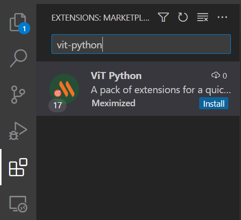
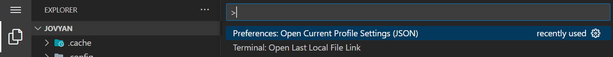

# About

This repository contains a VScode extension pack for python development and a configuration file you can use to make VScode look similar to Pycharm (settings.json)

# Installation

### Extensions

To install extensions simply search for "vit-python" in VScode extensions manager

### Settings

Open VScode editor commands (use Ctrl+Shift+P) and type "Preferences: Open Current Profile Settings (JSON)". Paste the content from repository settings.json file into your profile settings.

